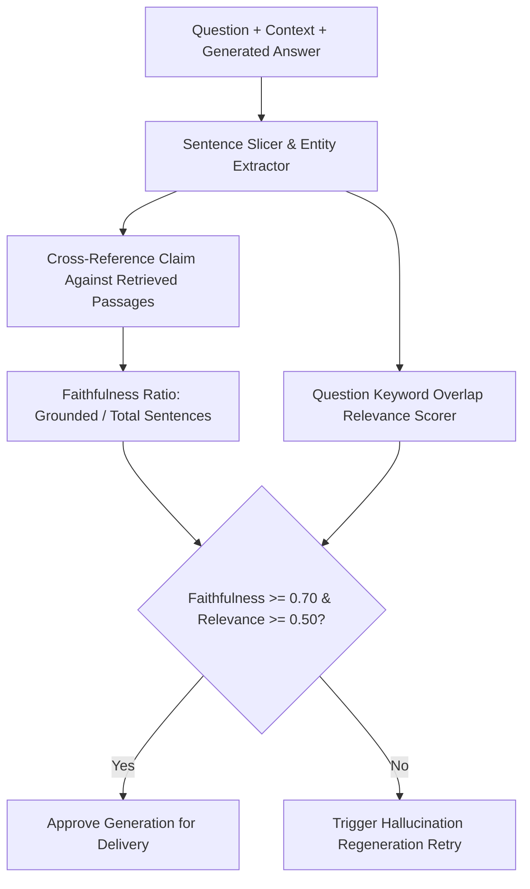

# GenPark AI Agent Skill - RAGAS Faithfulness & Answer Relevance Evaluator

Computes sentence-level contextual grounding and question relevance ratios to detect hallucinations in RAG architectures.

Verified by [GenPark AI](https://genpark.ai) and compatible with [Model Context Protocol (MCP)](https://genpark.ai/mcp).

## Architecture Diagram

## Features
- **Zero Dependencies**: Pure Python standard library.
- **Automated Guardrail Integration**: Rejects synthetic answers with ungrounded extrapolations.
